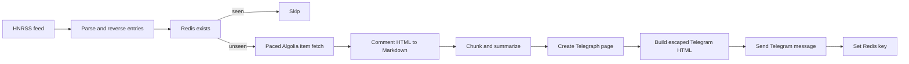

# hnbot Design Document

## Purpose

`hnbot` is a long-running Rust service that turns qualifying Hacker News discussions into structured Traditional Chinese articles and Telegram notifications.

This document covers the implemented Rust runtime, external contracts, reliability boundaries, and deployment model. It does not define a product roadmap or replace third-party API documentation.

## Runtime and deployment

- Binary: `hnbot`
- Supported command: `hnbot serve [--poll-interval SECONDS]`
- Deployment: Docker Compose only
- State: the existing persistent Redis volume
- Logging: structured JSON on stdout through `tracing`

Docker Compose builds a Rust binary in a pinned Rust 1.88 builder and copies it into a non-root Debian slim runtime. The hnbot container starts only after Redis passes its health check.

## Module boundaries

- `src/config.rs` — `.env` and environment parsing, defaults, required secrets, and numeric validation
- `src/cli.rs` — service-only Clap interface
- `src/http.rs` — transient HTTP retry, `Retry-After`, detailed transport errors, and global request pacing
- `src/rss.rs` — HNRSS retrieval and typed feed parsing
- `src/content.rs` — HTML-to-Markdown normalization and Unicode-safe chunking
- `src/article.rs` — article schema, prompt, validation, rendering, and recursive summarization
- `src/openai.rs` — OpenAI Responses API adapter using strict JSON schema
- `src/telegraph.rs` — Telegraph HTML sanitizer, Node JSON conversion, and page publishing
- `src/telegram.rs` — Telegram Bot API adapter and escaped notification formatting
- `src/store.rs` — async Redis dedupe adapter
- `src/app.rs` — service loop, concurrency limits, failure boundaries, dedupe ordering, and cancellation
- `src/main.rs` — tracing, configuration, CLI dispatch, and production adapter wiring

## End-to-end flow



The service processes one feed batch immediately. Batches never overlap; the configured polling delay begins only after all sibling entry futures finish.

## Data contracts

### Feed entry

`HnEntry` contains:

- title and source link
- HN comment URL and extracted ID
- UTC publication timestamp
- optional points and comment count

Feed entries are reversed before processing so qualifying stories are handled oldest-first.

### Article

`Article` contains a title, summary, and ordered `Section` list. Each section contains a title, one emoji, and body content. The OpenAI request includes a strict schema generated by `schemars`; returned content is parsed with `serde_json` and checked against length constraints.

### Redis

- Key: `hnbot:entry:{entry.id}`
- Value: HN comment URL
- TTL: none
- Write timing: only after Telegram confirms a successful send

This schema is unchanged, so existing Compose volumes remain usable without migration.

## External API adapters

All adapters use the configured User-Agent. HNRSS, Telegraph, and Telegram use `HTTP_TIMEOUT_SECONDS`; the HN comment API and OpenAI use dedicated `COMMENTS_FETCH_TIMEOUT_SECONDS` and `OPENAI_TIMEOUT_SECONDS` values because large discussions and generation can legitimately exceed the shorter general I/O timeout.

### HNRSS and HN comments

HNRSS is fetched from `/newest?points=...`. Each discussion is fetched as one nested item response from `HNBOT_COMMENTS_API_BASE_URL/{entry.id}` and rendered into heading-structured Markdown. This avoids rate-limited `news.ycombinator.com` page scraping and preserves replies beneath deleted comments.

Feed and comment API GETs retry transport failures, HTTP 429, and HTTP 5xx up to three attempts. Numeric and HTTP-date `Retry-After` values are honored. Comment API requests use their dedicated timeout, starts share a process-wide pacer, and a 429 extends the global cooldown using `Retry-After` or `COMMENTS_FETCH_429_COOLDOWN_SECONDS`.

### OpenAI

The adapter posts to `{OPENAI_BASE_URL}/responses` with Bearer authentication, the configured model, unchanged article instructions, and a strict JSON schema under `text.format`. It uses the dedicated generation timeout, and transport failures retain their source-chain cause (including timeouts) for diagnosis. API keys are held in redacted settings and are never included in tracing fields.

### Telegraph

The adapter creates an account, sanitizes generated HTML to Telegraph's allowed tags and attributes, converts it into Telegraph Node JSON, and creates a page. Unsupported or mismatched tags are escaped rather than executed.

### Telegram

The adapter posts `chat_id`, escaped HTML text, and `parse_mode=HTML` to `sendMessage`. Titles, summaries, source URLs, discussion URLs, and page URLs are escaped before interpolation.

## Concurrency and failure boundaries

Two Tokio semaphores apply per batch:

- comment fetch concurrency (`COMMENTS_FETCH_CONCURRENCY`, default 1)
- article generation/publishing concurrency (`ARTICLE_PIPELINE_CONCURRENCY`, default 3)

Failure behavior:

- feed failure after retries fails the batch; the service logs it and polls again later
- comment failure skips only that entry
- OpenAI/article/Telegraph failure skips only that entry
- Telegram or Redis failure is an unexpected entry failure and makes the batch fail after sibling futures finish
- failed entries are not written to Redis
- SIGINT and SIGTERM cancel the polling delay and let owned clients close through Rust RAII

## Observability and security

`tracing-subscriber` writes JSON to stdout and respects `RUST_LOG`. Settings use a custom redacted `Debug` implementation; OpenAI and Telegram credentials are never logged.

The service runs as a non-root user in the final container. Secrets are supplied through `.env`/environment variables and must not be committed. Compose runs Redis without authentication on the project network and does not expose Redis to the host network; external Redis deployments can still use `REDIS_PASSWORD`.

Data sent externally:

- HN discussion text is sent to OpenAI
- generated article content is published to a public Telegraph URL
- notification content is sent to the configured Telegram chat

## Testing

Rust tests cover settings, CLI, RSS parsing, Algolia discussion rendering/routing, retry/cooldown, pacing, timeout separation and diagnostics, Redis authentication propagation, content conversion, Unicode chunking, structured OpenAI requests, Telegraph sanitization, Telegram payloads, dedupe ordering, polling cancellation, and a fully mocked end-to-end service flow.

Contract fixtures under `tests/contracts/` are consumed by the Rust integration tests. External adapters use Wiremock; CI does not call live services or require secrets.

CI runs:

```sh
cargo fmt --check
cargo clippy --all-targets --all-features -- -D warnings
cargo test --all-targets
docker build --tag hnbot:test .
docker run --rm hnbot:test serve --help
```

## Runtime status

The repository, Dockerfile, CI, and Compose runtime target Rust. Recovery of the pre-rewrite implementation, if needed, uses Git history rather than a second in-tree runtime.
